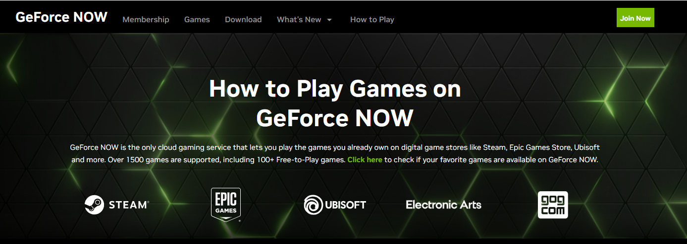
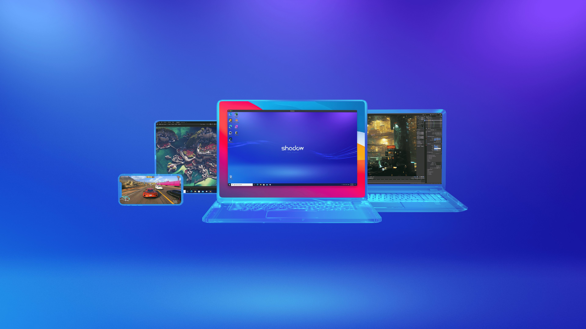

Are you a die-hard Fortnite fan looking to play the game on a variety of platforms? Look no further than cloud gaming! With this revolutionary technology, you can enjoy the game on desktop computers, gaming consoles, and even mobile devices. Let's take a look at some of the best cloud gaming platforms available!

## [1. GeForce Now by Nvidia](https://www.nvidia.com/en-us/geforce-now/)

GeForce Now is a cloud gaming service that lets you stream games from a remote server. This means you can play Fortnite without expensive hardware or consoles! The platform is free for one hour per day, and users can upgrade to a paid membership for unlimited access. Paid members also get access to Nvidia's GeForce RTX 4080 technology which enables ray-tracing for a beautiful experience. From experience, the connection and smoothness of the game is as good as your connection. But if you usually play online you should be fine. Get your Fortnite fix anytime, anywhere!

 

## [2. Shadow](https://shadow.tech/)

Shadow is a cloud gaming platform that lets you access a high-powered gaming computer remotely. The service is available on a variety of devices, including desktop computers, laptops, and smartphones. Users pay a monthly fee for access to the service and can install any games they own on a remote computer. Play Fortnite at peak performance!

Now that you know about the best cloud gaming platforms for Fortnite, this is generally how you would get started playing:

**Step 1:** Choose Your Platform
Consider the devices you plan to play on, the cost of the platform, and any other features or benefits offered.

**Step 2:** Sign Up for an Account
Depending on the platform, you may need to provide payment information when signing up.

**Step 3:** Download the Necessary Software
Follow the platform's instructions to download and install the necessary software.

**Step 4:** Launch the Platform
Once you've downloaded the software, sign in to your account and launch the platform.

**Step 5:** Choose Fortnite and Start Playing!
Select Fortnite from the list of available games, and start playing!
 
 
 
 
 
