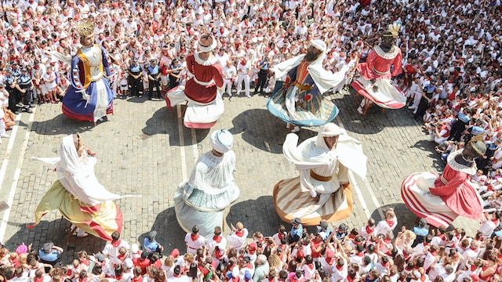

Humans are pretty cool, huh? We've got all sorts of unique qualities that set us apart from the rest of the animal kingdom. But what exactly makes us human? Let's dive into the wacky and wonderful world of humanity and find out!

#### Cognitive Abilities

Have you ever seen a dolphin doing calculus? Yeah, me neither. Humans have some pretty amazing cognitive abilities that allow us to think abstractly, reason logically, and solve complex problems. Plus, we've got language and communication skills that would make any dolphin jealous. With all these smarts, it's no wonder we've been able to build complex civilizations and achieve great feats of science and art.

#### Emotional Capacity

Humans are emotional creatures, and that's what makes us so darn lovable. We can experience a whole range of emotions, from happiness and joy to sadness and grief. And our ability to empathize with others and connect on an emotional level is what allows us to form strong bonds and build communities. So go ahead, let those tears flow. It's what makes us human!

#### Morality and Ethics

Humans are the only animals with a sense of morality and ethics. We've got complex systems of right and wrong, good and bad, and all sorts of other moral dilemmas. From our early days of communal living to our modern laws and social norms, we've been trying to figure out how to be good little humans. And let's be real, sometimes we mess up. But the fact that we're constantly striving to be better is what makes us truly unique.

#### Creativity and Innovation

Humans are a creative bunch. We've been making art and tools since the dawn of time, and we're not stopping anytime soon. We've got an innate desire to create and explore, and that's what's driven us to achieve great feats and make countless contributions to science, art, and culture. So go ahead, let your imagination run wild. You never know what kind of crazy stuff us humans will come up with next!

#### The Weird and Wonderful

</img> 
<small class="text-muted">Photo by <a href="https://unsplash.com/@sanfermin?utm_source=unsplash&utm_medium=referral&utm_content=creditCopyText">San Fermin Pamplona - Navarra</a> on <a href="https://unsplash.com/photos/0D7Wtqhe-AQ?utm_source=unsplash&utm_medium=referral&utm_content=creditCopyText">Unsplash</a></small>
  

Humans are a weird and wonderful species, and that's what makes us so darn special. We've got advanced cognitive abilities, emotional depth, complex moral systems, and a never-ending thirst for creativity and innovation. So the next time you're feeling down about being human, just remember that you're part of a pretty amazing club. And who knows, maybe one day we'll even figure out how to do calculus underwater.
