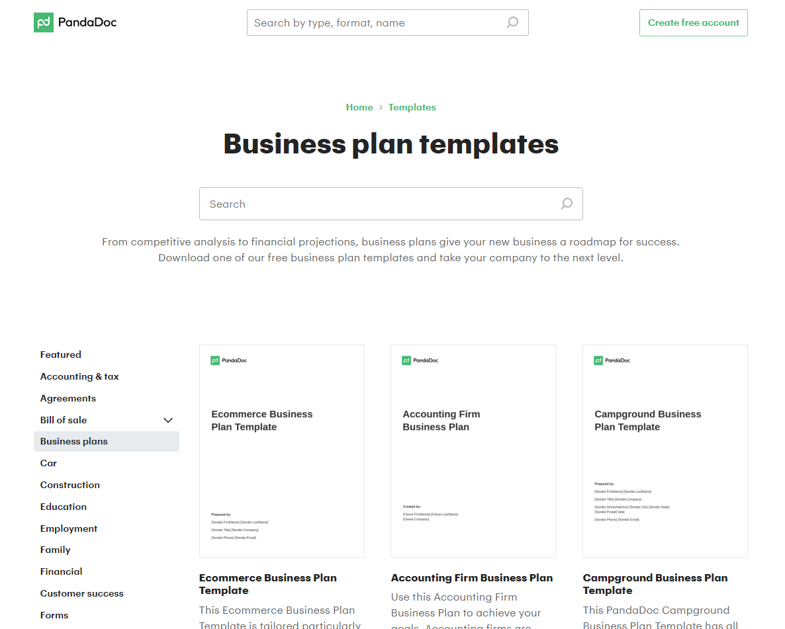

Starting a business in 2023 can seem daunting, but with the right planning and execution, it’s possible to turn your dream into a reality. There are a lot of factors to consider, from market research to funding, legal requirements, and team building. Here are the seven steps to follow to get your business up and running:

### Step 1: Identify your business idea

The first step in starting a business startup is to identify your business idea. You can come up with a unique idea or improve on an existing one. Identify a problem that needs solving or a gap in the market that you can fill. Ask yourself what problem your business will solve, what products or services you will offer, and who your target audience is. Research the market to ensure that there's a demand for your product or service.

### Step 2: Develop a business plan

Once you've identified your business idea, the next step is to develop a business plan. A business plan outlines your business's goals, strategies, market analysis, financial projections, and management structure. It’s important to create a comprehensive plan that will help guide you through every step of the process. You can find free business plan templates [here. ](https://www.pandadoc.com/business-plan-templates/)

Consider it a roadmap that guides your business operations and helps you secure funding.

### Step 3: Secure funding

Starting a business requires capital. You can fund your business through personal savings, loans, or investors. You can also consider crowdfunding platforms like Kickstarter or Indiegogo. If you're looking for investors, ensure that you have a solid business plan and pitch.

### Step 4: Register your business

Once you have secured funding, it’s time to register your business. Choose a business name, register for an EIN number, and obtain any necessary licenses or permits.

### Step 5: Set up your team

Starting a business requires a team effort. Identify the roles you need to fill and hire employees that have the necessary skills and expertise. You can also consider outsourcing some tasks to reduce costs. Your team is an essential part of your business. Hire employees or contractors who have the skills and experience necessary to help your business succeed. Make sure to create a positive work environment and provide your team with the resources they need to do their jobs.

### Step 6: Set up your workspace

Depending on your business, you may need to set up a physical workspace. This could be an office, retail space, or warehouse. Make sure to create a space that is conducive to productivity and reflects your brand. Ensure that you have the necessary equipment, such as computers and software, to run your business.

### Step 7: Launch your business

Once you've completed the above steps, you're ready to launch your business. Plan a launch event, create a marketing campaign, and start selling your products or services. Remember that launching your business is just the beginning. You will need to continually evaluate and adapt your business to ensure its success.

Starting a business can be a challenging but rewarding experience. By following these seven steps, you can turn your business idea into a successful venture. Remember to stay focused, be persistent, and always keep your customers at the forefront of your mind. Good luck!
